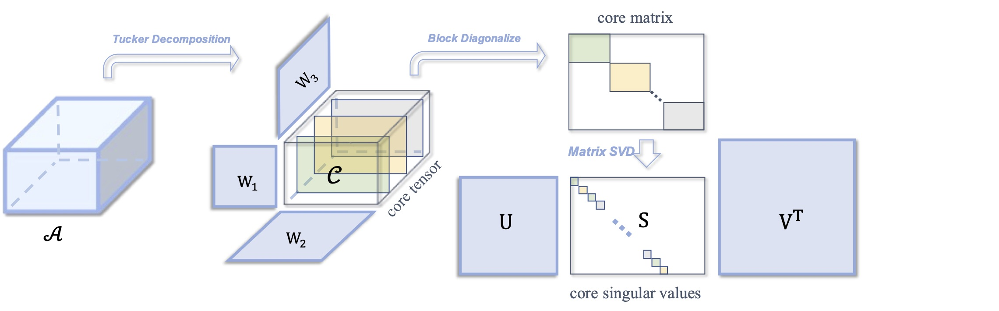
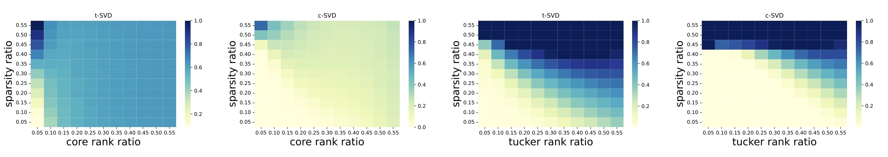

# Tensor robust PCA (TRPCA) via c-SVD

## Introduction

we propose a new tensor decomposition framework named core-SVD. The main idea of this method is to apply the matrix-SVD to the core matrix yield from Tucker decomposition. 

<p align="center">
	<a href="https://github.com/AnonymousStudy/c-SVD">
    
	</a>
</p>

## Contents
- [Demo](#Demo)
- [References](#references)


## Demo 

### prerequisites
* MATLAB R2021b

1. run the hyperspectral image denoising demo using:
```
matlab -nosplash -nodesktop < demo_hyperspectral_image_denoising.m
```

Below are some hyperspectral image denoising results, PSNR is reported:


methods    | TTNN (Tensor Train) | SNN (Tucker)| RTD (CP)       | TNN (t-SVD) | CNN   (c-SVD) 
---------|--------|-----|--------|-----|-----
[Toys](https://www1.cs.columbia.edu/CAVE/databases/multispectral/images/chart_and_stuffed_toy.png)     | 30.45 | 28.56 | 25.13| 34.10   | **39.59**   
[Feathers](https://www1.cs.columbia.edu/CAVE/databases/multispectral/images/feathers.png)     | 29.21 | 29.04 | 24.26 | 30.23   | **35.63**  
[Sponges](https://www1.cs.columbia.edu/CAVE/databases/multispectral/images/sponges.png)     | 37.53 | 38.31| 28.62 | 30.29   | **44.89**  
[Watercolors](https://www1.cs.columbia.edu/CAVE/databases/multispectral/images/watercolors.png)     | 29.68 | 28.92| 24.91| 36.27  | **39.51**  
[Paints](https://www1.cs.columbia.edu/CAVE/databases/multispectral/images/paints.png)   | 30.96 | 31.80 | 27.32 | 33.69  | **38.21**   
[Sushi](https://www1.cs.columbia.edu/CAVE/databases/multispectral/images/sushi.png)    | 32.92 | 31.80 | 30.25 | 33.45   | **37.56**  

2. run the simultation on phase Transition in rank and sparsity using:
```
matlab -nosplash -nodesktop < demo_simulation.m
```
Below are some simulation results, relative recovery errors is reported:




### References
<ol>
<li> L. D. Lathauwer, B. D. Moor and J. Vandewalle, A multilinear singular value decomposition, SIAM J. Matrix Analysis and Applications, 21(4):1253-1278, 2000
<li> Canyi Lu, Jiashi Feng, Yudong Chen, Wei Liu, Zhouchen Lin, Shuicheng Yan. Tensor Robust Principal Component Analysis with A New Tensor Nuclear Norm. TPAMI. 2019


